# 关于

> 《30 天自制操作系统.pdf》
>
> 【日】川合秀实 著
>
> 周自恒 译

# 0-开发前

## 什么是操作系统？

> 参考书籍：汤子瀛， 哲凤屏， 汤小丹. 计算机操作系统[M]. 西安电子科技大学出版社， 2001.

参考《计算机操作系统.md》

操作系统（英语：Operating System，缩写：OS）是一组主管并控制计算机操作、运用和运行硬件、软件资源和提供公共服务来组织用户交互的相互关联的系统软件程序。根据运行的环境，操作系统可以分为桌面操作系统，手机操作系统，服务器操作系统，嵌入式操作系统等。

## 如何开发操作系统

把含有操作系统的CD-ROM或软盘插入电脑，或者将操作系统装入硬盘后，只要打开电源开关就能自动运行

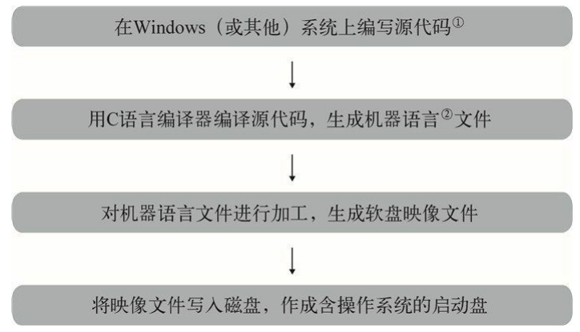

**世界上第一个操作系统又是怎么做出来的呢？**

在开发世界上第一个操作系统时，当然还没有任何现成的操作系统可供利用，因此那时候人们不得不对照着CPU的命令代码表，自己将0和1排列起来，然后再把这些数据写入磁盘（估计那个时候还没有磁盘，用的是其他存储设备）。

这是一项非常艰巨的工作。所以恐怕最初的操作系统功能非常有限，做好之后人们再利用它来开发一个稍微像点样的操作系统，然后再用这个来开发更实用的操作系统……操作系统应该就是这样一步一步发展过来的。

## 需要准备哪些环境

### vscode

一、下载 vscode 插件 Hex Editor，可以编辑 16 进制，但是不能删除和新增 16 进制

首先下载 [vscode](https://code.visualstudio.com/download)，下载插件 Hex Editor

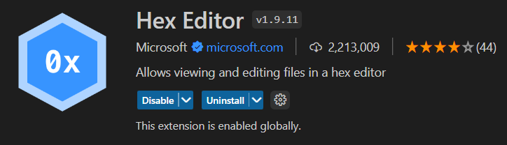

新建文件 helloos.img，双击打开，输入 123，保存，然后对着文件右键，重新打开

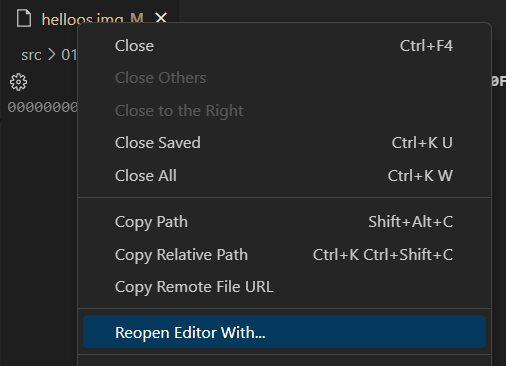

选择 Hex Editor（之所以先输入 123，是因为必须先有数据才能编辑）

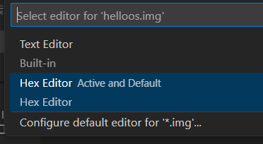

打开后效果如下

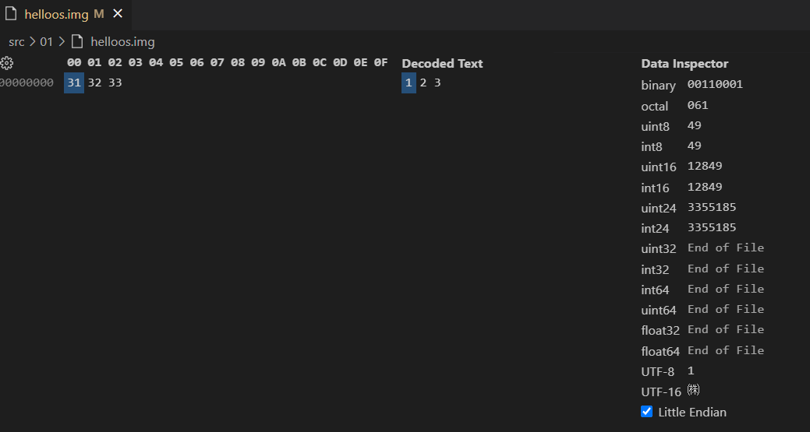

### 16 进制编辑器 HxD

下载 [HxD](https://mh-nexus.de/en/downloads.php?product=HxD20)，可以对 16 进制进行编辑和删除

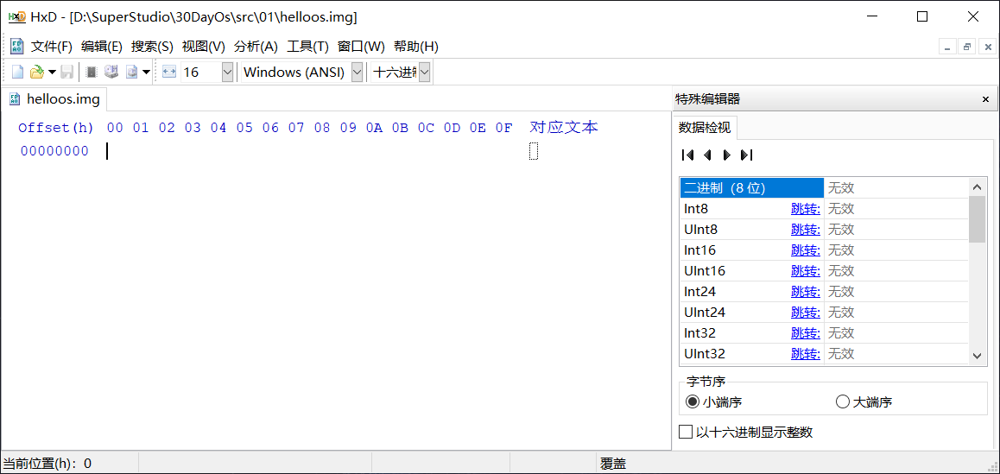

注意，高分辨率下注意调节一下 DPI 设置，对着 HxD.exe 右键-属性-兼容性-更改高DPI设置-替代高DPI缩放行为（应用程序）

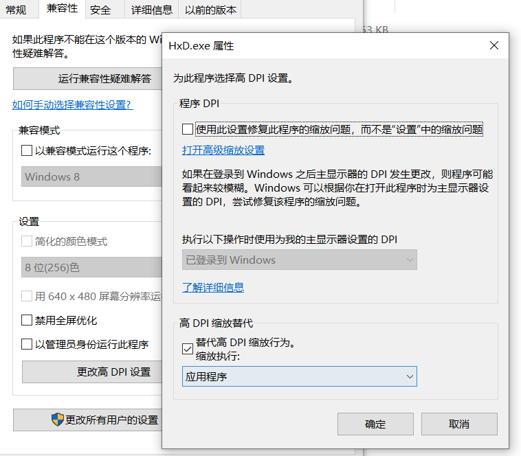

调节一下颜色和字体

字体

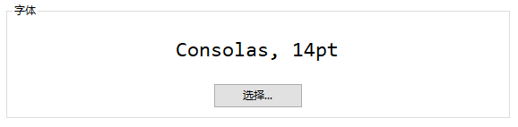

颜色

- 自定义背景色为：RGB(30,30,30)
- 自定义前景色为：RGB(198,198,198)
- 选定文字背景色为：RGB(38,79,120)

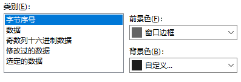

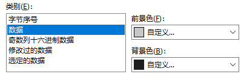

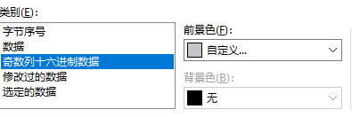

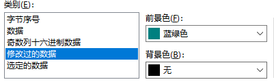

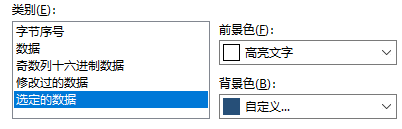

效果如下，和 VsCode 的 HexEditor 显示效果一模一样

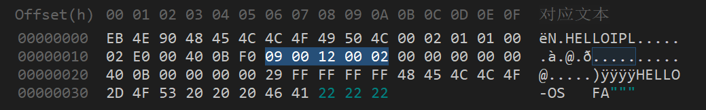

### PC 模拟器-QEMU

下载 [QEMU](https://www.qemu.org/download/)，可能下载速度会很慢

# 1-汇编程序入门

## 制作启动盘

打开 HxD，输入以下内容，输入到 **000037** 位置时的画面如下

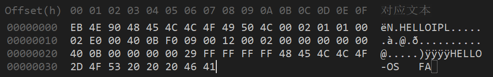

从 **000090** 开始后面全都是00，一直输入到最后 **168000** 这个地址，手动输入的话可能需要输入一天……

快速方法：点击编辑-插入字节，字节数目填写为 168000

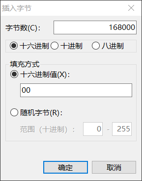

删除多出的几行，保存后效果如下

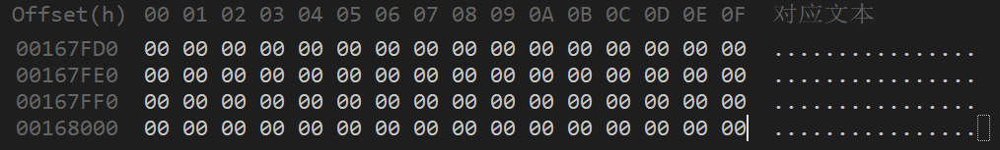

在地址 **0001F0** 和 **001400** 附近还有些地方不全是00，要像下图那样把它们也改过来

> 可以点击搜索-跳转，输入 0001F0 进行跳转

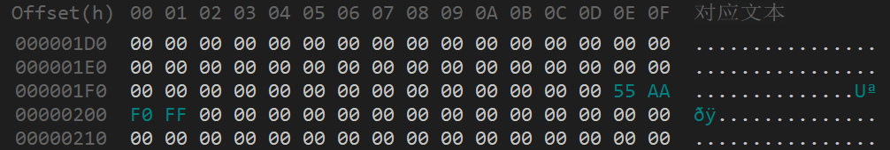

---

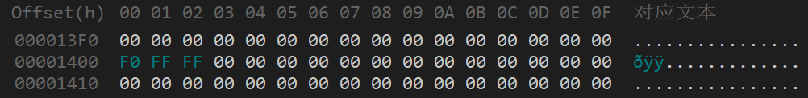