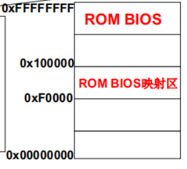

https://www.bilibili.com/video/BV1d4411v7u7

# 操作系统基础

什么是操作系统？

操作系统是计算机硬件和应用之间的一层软件

- 方便用户使用硬件，如使用显存
- 高效使用硬件，如开多个终端（窗口）

管理哪些硬件？

cpu，内存，终端，磁盘，文件，网络，电源，多核

操作系统的三层架构


## 通用图灵机

设置控制器动作最关键，他决定了控制器执行什么操作（加、减）


## 计算机

五大部件：输入设备、输出设备、存储器、运算器、控制器

计算机处理的主要思想：将程序和数据放到计算机内部的存储器中（内存），计算机在程序的控制下一步一步进行处理，即**取指执行**

如下图，首先将程序放到存储器中（内存），然后用一个指针指向它（IP指针或PC指针），然后**取出指令**，载入到控制器里**解释执行**，然后指针继续指向下一个指令，继续执行


PC-program counter

IP-instrument point


## 实模式和保护模式

https://www.cnblogs.com/chenwb89/p/operating_system_002.html

### 实模式

​		CPU复位（reset）或加电（power on）的时候就是以**实模式**启动，在这个时候处理器以实模式工作，存在的时间非常之短，所以一般我们是感觉不到它的存在的。实模式不能实现权限分级，也不能访问20位以上的地址线，也就是只能访问1M内存。之后一般就加载操作系统模块，进入保护模式。
　　处理器 8086 有 20 根地址线，可以寻址 1MB 内存。但是，它内部的寄存器16 位的，无法在程序中访问整个 1MB 内存。所以，它也是第一款支持**内存分段模型**的处理器。还有， 8086 处理器只有一种工作模式，即实模式。

　　由于 8086 处理器的成功，推动着 Intel 公司不断地研发更新的处理器， 32 位的时代就这样到来了。尽管 8086 是 16 位的处理器，但它也是 32位架构内的一部分。原因在于， 32 位的处理器架构是从 8086 那里发展来的，是基于 8086 的，具有延续性和兼容性。

　　32位处理器有自己的 32 位工作模式。在本系列文章中，保护模式其实就是32位模式。在这种模式下，可以完全、充分地发挥处理器的性能。同时，在这种模式下，处理器可以使用它全部的 32 根地址线，能够访问4GB 内存。

**实模式的寻址方式与工作机理**

​		8086的段寄存器和IP寄存器都是16位的，如果按照原先的方式，把段寄存器的内容和偏移地址直接相加来形成物理地址的话，也只能得到 16 位的物理地址。麻烦的是，8086却提供了20根地址线。换句话说，它提供的是20位的物理地址。

　　提供 20 位地址线的原因很简单， **16 位的物理地址只能访问 64KB 的内存**，地址范围是0000H～FFFFH，共 65536 个字节。这样的容量，即使是在那个年代， 也显得捉襟见衬。注意，这里提到了一个表示内存容量的单位“ KB”。为了方便，我们通常使用更大的单位来描述内存容量，比如千字节（ KB）、兆字节（ MB）和吉字节（ GB）。
　　所以，65536个字节就是64KB，而 20 位的物理地址则可以访问多达1MB的内存，地址范围从 00000H到FFFFFH。问题是，16 位的段地址和 16 位的偏移地址相加，只能形成 16 位的物理地址，怎么得到这 20位的物理地址呢？

　　为了解决这个问题，8086 处理器在形成物理地址时，**先将段寄存器的内容左移 4 位（相当于乘以十六进制的10，或者十进制的 16），形成 20 位的段地址，然后再同16位的偏移地址相加，得到20位的物理地址**。比如，对于逻辑地址 F000H:052DH，处理器在形成物理地址时，将段地址F000H左移 4 位，变成 F0000H，再加上偏移地址052DH，就形成了20位的物理地址 F052DH。
　　这样，因为段寄存器是16位的，在段不重叠的情况下，最多可以将1MB的内存分成65536个段，段地址分别是0000H、0001H、0002H、0003H，……，一直到FFFFH。

　　一个地址有段和偏移两部分组成，物理地址的计算公式为：
$$
物理地址（physical \ address）=段值（segment） * 16 + 偏移（offset） \\ 其中，segment和offset都是16位的。
$$
　　在这种模式下，系统计算实际地址的时候是按照对1M求模的方式进行的，这种技术被称为wrap-around。也就是说，当程序员给出超过1M（100000H-10FFEFH）的地址时，因为逻辑上正常，系统并不认为其访问越界而产生异常，而是自动从0开始计算。

### 保护模式

​		最开始的程序寻址是直接的“段：偏移”模式，这样的好处是所见即所得，程序员指定的地址就是物理地址，物理地址对程序员是可见的。这就带来一些问题：1）无法支持多任务2）程序的安全性无法得到保证。

　　在windows的旧版本中，我们时不时就死机或者蓝屏，其实发生这些问题大部分就是由于内存被破坏引起的。因为在实模式中，将整个物理内存看成分段的区域，程序代码和数据位于不同区域，系统程序和用户程序没有区别对待，而且每一个指针都是指向"实在"的物理地址。这样一来，用户程序的一个指针如果指向了系统程序区域或其他用户程序区域，并改变了值，那么对于这个被修改的系统程序或用户程序，容易造成软件甚至系统崩溃。

　　而在保护模式下，**全部32条地址线有效，可寻址高达4G字节的物理地址空间**，并扩充了**存储器分段管理机制**和可选的**存储器分页管理机制**，不仅为存储器共享和保护提供了硬件支持，而且为实现虚拟存储器提供了硬件支持，支持多任务，能够快速地进行任务切换和保护任务环境，4个特权级和完善的特权检查机制，既能实现资源共享又能保证代码和数据的安全和保密及任务的隔离，支持虚拟8086方式，便于执行8086程序。
　　**保护模式出现的原因是：保护进程地址空间。**这样，就产生了一个结果：两种模式下程序的寻址方式发生了变化。

**保护模式的寻址方式和工作原理**

　　在保护模式下地址的表示方式与实模式是一样的，都是：段（segment）:偏移（offset），不过保护模式下，“段”的概念发生了根本性的改变。实模式下，段值还是可以看作是地址的一部分，比如段值为xxxxh表示以xxxx0h开始的一段内存。

​		而保护模式下，虽然段值仍然由原来的cs、ds等寄存器表示，但此时它仅仅变成了一个**索引**，**这个索引指向了一个数据结构的一个表项，表项中详细定义了段的起始地址、界限、属性等内容**。这个数据结构就是**全局描述符**GDT（也有可能是LDT）。

　　GDT的作用是用来提供段式存储机制，这种机制是段寄存器和GDT中的描述符共同提供的。每个描述符在GDT中占8字节，也就是 2 个双字，或者说是 64 位。下图中，下面是低32位，上面是高32位。


​		显然，描述符中指定了 32 位的段起始地址，以及 20 位的段边界。在实模式下，段地址并非真实的物理地址，在计算物理地址时，还要左移 4 位（乘以 16）。和实模式不同，在 32 位保护模式下，段地址是 32 位的线性地址，如果未开启分页功能，该线性地址就是物理地址。

### GDT

​		全局描述表(GDT Global Descriptor Table)：在保护模式下一个重要的数据结构

​		GDT可以被放在内存的任何位置，那么当程序员通过段寄存器来引用一个段描述符时，CPU必须知道GDT的入口，也就是**基地址**放在哪里，所以Intel的设计者门提供了一个寄存器GDTR用来存放GDT的入口地址，程序员将GDT设定在内存中某个位置之后，可以通过LGDT指令将GDT的入口地址装入此寄存器，从此以后，CPU就根据此寄存器中的内容作为GDT的入口来访问GDT了


### IDT

​		中断描述符表（Interrupt Descriptor Table，IDT）**将每个异常或中断向量分别与它们的处理过程联系起来**，是由8字节长描述符组成的一个数组。

​		IDT表可以驻留在线性地址空间的任何地方，处理器使用IDTR寄存器来定位IDT表的位置。

​		在实地址模式中，CPU把内存中从0开始的1K字节作为一个**中断向量表**。表中的每个表项占四个字节，由两个字节的段地址和两个字节的偏移量组成，这样构成的地址便是相应中断处理程序的入口地址。但是，在保护模式下，由四字节的表项构成的中断向量表显然满足不了要求。这是因为，?除了两个字节的段描述符，偏移量必用四字节来表示；?要有反映模式切换的信息。因此，在保护模式下，中断向量表中的表项由8个字节组成，中断向量表也改叫做中断描述符表IDT（InterruptDescriptor Table）。其中的每个表项叫做一个门描述符（gate descriptor），“门”的含义是当中断发生时必须先通过这些门，然后才能进入相应的处理程序。


## 计算机开机过程

开机主要有三个过程：

1. 读取引导扇区代码
2. 读入 setup 模块
3. 加载 system 模块


对于 X86 PC，过程如下

```
(1)x86 PC刚开机时CPU处于实模式（和保护模式对应，实模式的寻址CS:IP(CS左移4位+IP)， 和保护模式不一样）
(2)开机时，CS=0xFFFF; IP=0x0000
(3)寻址0xFFFF0(ROM BIOS映射区)
(4)检查RAM，键盘，显示器，软硬磁盘
(5)将磁盘0磁道0扇区（引导扇区）读入0x7c00处(读入512个字节)
(6)设置cs=0x07c0，ip=0x0000
```




读取 0x7c00 处存放的代码具体过程如下：

- 从磁盘引导扇区读入的那512个字节
- 引导扇区就是启动设备的第一个扇区
- 启动设备信息被设置在CMOS中
- 因此，硬盘的第一个扇区上存放着开机 后执行的第一段我们可以控制的程序

操作系统的故事由此开始...

### 读取引导扇区代码

引导扇区代码：bootsect.s（汇编代码）

```
BOOTSEG = 0x07c0
INITSEG = 0x9000
SETUPSEG = 0x9020
```

```java
.globl begtext,begdata,begbss,endtext,enddata,endbss
.text //文本段
begtext:
.data //数据段
begdata:
.bss //未初始化数据段
begbss:
entry start //关键字entry告诉链接器“程序入口”
start:
	// mov a,b => 将 a=b（赋值）
    mov ax, #BOOTSEG mov ds, ax //最后 ds=#BOOTSEG=0x07c0
    mov ax, #INITSEG mov es, ax // es=#INITSEG=0x9000
    mov cx, #256 
    sub si, si sub di,di //将0x07c0:0x0000处的256个字移动到0x9000:0x0000处
    rep movw //再次重复以上操作一次，总共移动了 512 个字节
    jmpi go, INITSEG //这里 go 是标号，表示跳转到下面的 go 标号处
    // jmpi - jump intersegment段间跳转：cs=INITSEG，ip=go
     
go: mov ax,cs //cs=0x9000
	mov ds,ax mov es,ax mov ss,ax mov sp,#0xff00
load_setup: //载入setup模块
    mov dx,#0x0000 mov cx,#0x0002 mov bx,#0x0200 //mov cx,#0x0002 表示开始扇区为第 2 个扇区（cl=2,第1个是bootsect）
    //0x13是BIOS读磁盘扇区的中断: ah=0x02-读磁盘，al=扇区数量(SETUPLEN=4)，ch=柱面号，cl=开始扇区，dh=磁头号，dl=驱动器号，es:bx=内存地址
    mov ax,#0x0200+SETUPLEN int 0x13 //BIOS中断
    jnc ok_load_setup
    mov dx,#0x0000
    mov ax,#0x0000 //复位
    int 0x13
    j load_setup //重读
```


读入setup模块后: ok_load_setup

```java
Ok_load_setup: //载入setup模块
    mov dl,#0x00 mov ax,#0x0800 //ah=8获得磁盘参数
    int 0x13 mov ch,#0x00 mov sectors,cx
    mov ah,#0x03 xor bh,bh int 0x10 //读光标
    mov cx,#24 mov bx,#0x0007 //#24为输出字符的数量
    mov bp,#msg1 mov ax,#1301 int 0x10 //显示字符到显示器上(bios 10 号中断)- 语句1
    mov ax,#SYSSEG //SYSSEG=0x1000 
    mov es,ax 
    call read_it //读入system模块【重要】
    jmpi 0,SETUPSEG
```

执行到语句1时，会在显示器上显示字符，这些字符存储在 bootsect.s 中

```java
bootsect.s中的数据 //在文件末尾
sectors: .word 0 //磁道扇区数
msg1:.byte 13,10
    .ascii “Loading system...”//这里就是开机屏幕下输出的字符
    .byte 13,10,13,10
```

启动盘加载完 boot 后，将控制权交给 setup 的加载

```java
jmpi 0, SETUPSEG //转入setup执行了
```

实验1：修改 bootsect.s ，改为自己的 logo

### setup模块

即setup.s ，将完成OS启动前的设置

```java
start: mov ax,#INITSEG mov ds,ax mov ah,#0x03
    xor bh,bh int 0x10  mov [0],dx //取出光标位置(包括其他硬件参数)到0x90000处
    mov ah,#0x88 int 0x15 mov [2],ax ...//扩展内存大小
    cli ///不允许中断
    mov ax,#0x0000 cld
do_move: mov es,ax add ax,#0x1000
    cmp ax,#0x9000 jz end_move
    mov ds,ax sub di,di
    sub si,si
    mov cx,#0x8000
    rep //将system模块 移到0地址
    movsw
    jmp do_move
```

此时内存如下

内存地址 | 长度| 名称
--|--|--|
0x90000| 2| 光标位置
0x90002 |2| 扩展内存数
0x901FC |2| 根设备号
0x9000C |2| 显卡参数

接着继续执行

```java
end_move: mov ax,#SETUPSEG mov ds,ax
	lidt idt_48 lgdt gdt_48//设置保护模式下的中断和寻址 进入保护模式的命令...
idt_48:.word 0 .word 0,0 //保护模式中断函数表
gdt_48:.word 0x800 .word 512+gdt,0x9 //用GDT将cs:ip变成物 理地址
gdt: .word 0,0,0,0	
    .word 0x07FF, 0x0000, 0x9A00, 0x00C0
    .word 0x07FF, 0x0000, 0x9200, 0x00C0
```

**什么是中断？**

所谓中断是指CPU在正常执行程序的过程中，由于内部/外部事件的触发或由程序的预先安排，引起CPU暂时中断当前正在运行的程序，而转去执行为内部/外部事件或程序预先安排的事件的服务子程序，待中断服务子程序执行完毕后，CPU再返回到被暂时中断的程序处（断点）继续执行原来的程序，这一过程成为中断。

- 中断向量：中断的地址的变量；

- 中断向量表：中断类型号与相应中断源的中断处理程序入口地址之间的连接表；

- 中断服务程序：发送中断时所执行的中断代码

操作系统要让硬件进入**保护模式**了，保护模式下 int n 和 cs:ip 解释不再和实模式一样


保护模式下的地址翻译和中断处理

**GDT 的作用：保护模式下进行地址翻译**

- 实模式 下:cs左移4+ip。保护模式下:根据cs查表+ip


**IDT 的作用：保护模式下中断处理函数入口**

- 通过 int n 的 n 进行查表


#### 进入保护模式

```java
//8042是键盘控制器，其输出端口P2用来控制A20地址线
//选通A20地址线 call empty_8042
call empty_8042 mov al,#0xD1 out #0x64,al //D1表示写数据到8042的P2端口
call empty_8042 mov al,#0xDF out #0x60,al
初始化8259(中断控制) //一段非常机械化的程序
mov ax,#0x0001 mov cr0,ax
jmpi 0,8
```

```
empty_8042:
    .word 0x00eb,0x00eb
    in al,#0x64
    test al,#2
    jnz empty_8042
    ret
```


# 操作系统接口

什么是命令行？

命令：一段程序，如有一段 C 语言程序

```C
#include <stdio.h>
int main(int argc, char * argv[])
{ 
    printf(“ECHO:%s\n”, argv[1]); 
}
```

经过编译 `gcc –o output output.c `，然后在命令行下运行


**操作系统接口**：连接上层用户和操作系统，如用 C 语言连接


对于操作系统来说，存在以下接口分类：

<table >
    <tr>
        <th>分类</th>
        <th>POSIX 定义</th>
        <th>描述</th>
    </tr>
    <tr>
        <td rowspan="3">任务管理</td>
        <td><b style="color:red">fork</b></td>
        <td>创建一个进程</td>
    </tr>
    <tr>
        <td>execl</td>
        <td>运行一个可执行程序</td>
    </tr>
    <tr>
        <td>pthread_create</td>
        <td>创建一个线程</td>
    </tr>
    <tr>
        <td rowspan="3">文件系统</td>
        <td><b style="color:red">open</b></td>
        <td>打开一个文件或目录</td>
    </tr>
    <tr>
        <td><b style="color:red">EACCES</b></td>
        <td>返回值，表示没有权限</td>
    </tr>
    <tr>
        <td>mode_t st_mode</td>
        <td>文件头结构: 文件属性</td>
    </tr>
</table>


